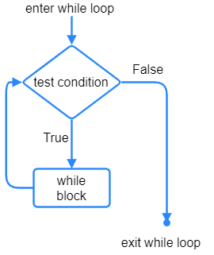
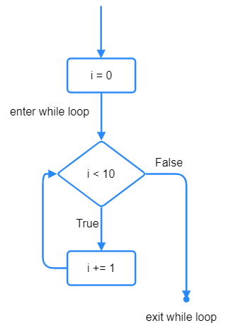

====================================================
EXT: While loops
====================================================

| See: `<https://www.w3schools.com/python/python_while_loops.asp
| While loops run a set of statements as long as a test condition is true.
| The statements within the loop are indented.

Events as conditions
----------------------------------------

| While loops have a condition that is tested each time the loop runs.
| The condition must be True for the loop to run.
| If the condition is False, the loop is exited.

| Button pressing can be used as the condition in a while-loop.
| In the code below, the code within the while-loop runs only while the A-button is being held down.

.. code-block:: python

    from microbit import *

    while True:
        while button_a.is_pressed():
            display.show(['I', Image.HEART, 'U'], delay=400)
            sleep(300)
        display.show(Image.ALL_CLOCKS, delay=50)

----

.. admonition:: Tasks

    #. Write a while-loop that displays a happy face while the A-button is pressed, and when it is not, Image.ALL_CLOCKS is used to display a rotating clock hand.
    #. Write a while-loop that displays a sad face while the B-button is pressed, and when it is not, Image.ALL_CLOCKS is used to display a rotating clock hand.

    .. dropdown::
        :icon: codescan
        :color: primary
        :class-container: sd-dropdown-container

        .. tab-set::

            .. tab-item:: Q1

                Write a while-loop that displays a happy face while the A-button is pressed, and when it is not, Image.ALL_CLOCKS is used to display a rotating clock hand.

                .. code-block:: python

                    from microbit import *

                    while True:
                        while button_a.is_pressed():
                            display.show(Image.HAPPY)
                            sleep(300)
                        display.show(Image.ALL_CLOCKS, delay=50)

            .. tab-item:: Q2

                Write a while-loop that displays a sad face while the B-button is pressed, and when it is not, Image.ALL_CLOCKS is used to display a rotating clock hand.

                .. code-block:: python

                    from microbit import *

                    while True:
                        while button_b.is_pressed():
                            display.show(Image.SAD)
                            sleep(300)
                        display.show(Image.ALL_CLOCKS, delay=50)

----

Counters
----------------------------------------

| While loops have a condition that is tested each time the loop runs.
| The condition must be True for the loop to run.
| If the condition is False, the loop is exited.

| A counter can be used in the while-loop condition.
| The counter is set before the while-loop.
| The counter is incremented (increased by a constant amount) in a while-loop.

----

Counting up
----------------------------------------

| In the example below, ``i`` is the counter.
| ``i`` starts off at 0 and is increased by 1 in the while-loop line: ``i += 1``.
| ``i += 1`` is the same as ``i = i + 1``
| While the condition, ``i < 10``, is True the while-loop runs.
| ``i += 1`` causes ``i`` to increase from 0 to 9.
| The while-loop exits when ``i`` is 10 since ``i < 10`` will be False when ``i = 10``.

.. code-block:: python

    from microbit import *

    while True:
        i = 0
        while i < 10:
            display.scroll(i, delay=50)
            i += 1

----

Counting down
----------------------------------------

| In the code below, ``i`` starts off at 5 and is decreased by 1 in the while-loop line: ``i -= 1``.
| ``i -+= 1`` is the same as ``i = i - 1``
| The test uses a ``>`` sign when counting down.
| The loop below stops when ``i`` is no longer greater than 1, i.e. when it is 1.

.. code-block:: python

    from microbit import *

    while True:
        i = 5
        while i > 1:
            display.scroll(i, delay=50)
            i -= 1

----

Step size
----------------------------------------

| The code below counts up from 0 to 10 in steps of 2.
| ``i += 2`` sets a step size of 2.

.. code-block:: python

    from microbit import *

    while True:
        i = 0
        while i < 11:
            display.scroll(i, delay=50)
            i += 2

----

.. admonition:: Tasks

    #. Write a while-loop that counts up from 1 to 5, showing the numbers 1, 2, 3, 4, 5.
    #. Write a while-loop that counts up from 3 to 12 in steps of 3, scrolling the numbers 3, 6, 9, 12.
    #. Write a while-loop that counts down from 9 to 1, showing the numbers 9, 8, 7, 6, 5, 4, 3, 2, 1.
    #. Write a while-loop that counts down from 24 to 18 in steps of 2, scrolling the numbers 24, 22, 20, 18.
    #. Write 2 while loops to scroll 0 to 8 going up in 2s then 9 down to 1 going down in 2s.

    .. dropdown::
        :icon: codescan
        :color: primary
        :class-container: sd-dropdown-container

        .. tab-set::

            .. tab-item:: Q1

                Write a while-loop that counts up from 1 to 5, showing the numbers 1, 2, 3, 4, 5.

                .. code-block:: python

                    from microbit import *

                    while True:
                        i = 1
                        while i < 6:
                            display.scroll(i, delay=50)
                            i += 1

            .. tab-item:: Q2

                Write a while-loop that counts up from 3 to 12 in steps of 3, scrolling the numbers 3, 6, 9, 12.

                .. code-block:: python

                    from microbit import *

                    while True:
                        i = 3
                        while i < 13:
                            display.scroll(i, delay=50)
                            i += 3

            .. tab-item:: Q3

                Write a while-loop that counts down from 9 to 1, showing the numbers 9, 8, 7, 6, 5, 4, 3, 2, 1.

                .. code-block:: python

                    from microbit import *

                    while True:
                        i = 9
                        while i > 0:
                            display.scroll(i, delay=50)
                            i -= 1

            .. tab-item:: Q4

                Write a while-loop that counts down from 24 to 18 in steps of 2, scrolling the numbers 24, 22, 20, 18.

                .. code-block:: python

                    from microbit import *

                    while True:
                        i = 24
                        while i > 17:
                            display.scroll(i, delay=50)
                            i -= 2

            .. tab-item:: Q5

                Write 2 while loops to scroll 0 to 8 going up in 2s then 9 down to 1 going down in 2s.

                .. code-block:: python

                    from microbit import *

                    while True:
                        i = 0
                        while i < 9:
                            display.scroll(i, delay=50)
                            i += 2
                        i = 9
                        while i > 0:
                            display.scroll(i, delay=50)
                            i -= 2
                        sleep(1000)