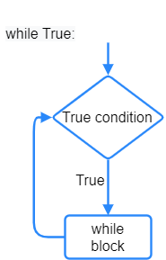

====================================================
while True loops
====================================================

| See: `<https://www.w3schools.com/python/python_while_loops.asp
| While loops run a set of statements as long as a test condition is true.

While true
----------------------------------------

| ``while True:`` loops run forever.
| Instead of using a condition that returns True or False, ``True`` is used in place of the condition to make the condition always True. As a result, the while-loop runs forever.

| The statements within the loop are indented with the tab key (which is equivalent to 4 spaces) to make those lines part of the while-loop.

| The ``while True`` loop below scrolls the text ``I never stop`` across the LED display, over and over again.

.. code-block:: python

    from microbit import *

    while True:
        display.scroll('I never stop')

When testing code on the microbit, it can be useful to do it within a ``while True`` loop so the results can be seen over and over again.

----

.. admonition:: Questions

    Find the error in the first line of these while loops.

    #. ``while true:``
    #. ``While True:``
    #. ``while True``

    .. dropdown::
        :icon: codescan
        :color: primary
        :class-container: sd-dropdown-container

        .. tab-set::

            .. tab-item:: Q1

                ``while true:`` error

                .. code-block:: python

                    # must have upper case T
                    while True:

            .. tab-item:: Q2

                ``While True:`` error

                .. code-block:: python

                    # must have lower case w
                    while True:

            .. tab-item:: Q3

                ``while True`` error

                .. code-block:: python

                    # must have colon at end
                    while True:
