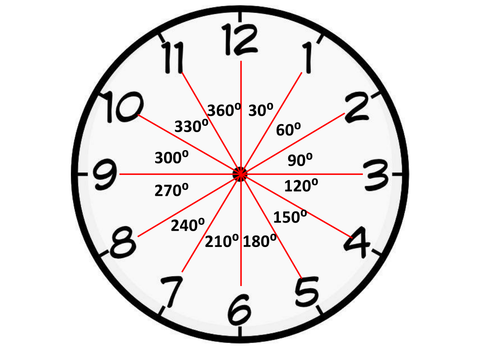

====================================================
Compass Directions
====================================================

Compass Readings
--------------------

Use ``compass.heading()`` to get an angle from True North where North is 0.

.. code-block:: python

    from microbit import *

    compass.calibrate()

    while True:
        display.scroll(compass.heading(), delay=80)
        sleep(500)

----

.. admonition:: Exercises

    #. Use the code above and turn the microbit till it reads a number close to 0.    
    #. Turn about 90 degrees clockwise to the East and get the reading.
    #. Turn another 90 degrees clockwise to the South and get the reading.
    #. Turn another 90 degrees clockwise to the West and get the reading.

----

Compass Pointer
--------------------

| The compass has readings from 0 to 359 degrees. (360 degrees is 0 degrees.)
| This can be divided up into 12 directions like the hours on a clock.
| The code below is to test the formula used.
| For readings from 346 to 15, the clock position should be at 12 or 0 o'clock.
| For readings from 16 to 45, the clock position should be at 11 o'clock.
| For readings from 46 to 75, the clock position should be at 10 o'clock.
| For readings from 316 to 345, the clock position should be at 1 o'clock.
| For readings from 286 to 315, the clock position should be at 2 o'clock.
| So the clock hand points towards north, while the reading is the direction the top (where the USB connection is) of the microbit is pointing towards.

.. code-block:: python

    from microbit import *

    # compass.calibrate()  # should be OK without recalibrating

    while True:
        display.scroll(compass.heading(), delay=60)
        needle = ((-compass.heading() + 15) // 30) % 12
        display.show(Image.ALL_CLOCKS[needle])
        sleep(500)

----

.. admonition:: Tasks

    #. What are the readings for 1 o'clock? Write code to test three values at either end of the range.
    #. What are the readings for 2 o'clock? Write code to test three values at either end of the range.
    #. What are the readings for 11 o'clock? Write code to test three values at either end of the range.
    #. What are the readings for 10 o'clock? Write code to test three values at either end of the range.

    .. dropdown::
            :icon: codescan
            :color: primary
            :class-container: sd-dropdown-container

            .. tab-set::

                .. tab-item:: Q1

                    What are the readings for 1 o'clock? Write code to test three values at either end of the range.

                    About 345 to 316

                    .. code-block:: python

                        from microbit import *

                        compass_heading_list = [346, 345, 344, 316, 315, 314]
                        while True:
                            for compass_heading in compass_heading_list:
                                display.scroll(compass_heading, delay=60)
                                needle = ((-compass_heading + 15) // 30) % 12
                                display.show(Image.ALL_CLOCKS[needle])
                                sleep(500)

                .. tab-item:: Q2

                    What are the readings for 2 o'clock? Write code to test three values at either end of the range.

                    About 315 to 286

                    .. code-block:: python

                        from microbit import *

                        compass_heading_list = [316, 315, 314, 286, 285, 284]
                        while True:
                            for compass_heading in compass_heading_list:
                                display.scroll(compass_heading, delay=60)
                                needle = ((-compass_heading + 15) // 30) % 12
                                display.show(Image.ALL_CLOCKS[needle])
                                sleep(500)

                .. tab-item:: Q3

                    What are the readings for 11 o'clock? Write code to test three values at either end of the range.

                    About 16 to 45

                    .. code-block:: python

                        from microbit import *

                        compass_heading_list = [14, 15, 16, 44, 45, 46]
                        while True:
                            for compass_heading in compass_heading_list:
                                display.scroll(compass_heading, delay=60)
                                needle = ((-compass_heading + 15) // 30) % 12
                                display.show(Image.ALL_CLOCKS[needle])
                                sleep(500)

                .. tab-item:: Q4

                    What are the readings for 10 o'clock? Write code to test three values at either end of the range.

                    About 46 to 75

                    .. code-block:: python

                        from microbit import *

                        compass_heading_list = [44, 45, 46, 74, 75, 76]
                        while True:
                            for compass_heading in compass_heading_list:
                                display.scroll(compass_heading, delay=60)
                                needle = ((-compass_heading + 15) // 30) % 12
                                display.show(Image.ALL_CLOCKS[needle])
                                sleep(500)

----

.. admonition:: Exercises
    
    #. Place a small piece of paper on the ground. Turn so the clock hand points to 0 o'clock and walk 5 paces. Turn so the clock hand points to 4 o'clock and walk 5 paces. Turn so the clock hand points to 8 o'clock and walk 5 paces. Did you end up at your starting point?
    #. Place a small piece of paper on the ground. Turn so the clock hand points to 0 o'clock and walk 5 paces. Turn so the clock hand points to 3 o'clock and walk 5 paces. Turn so the clock hand points to 6 o'clock and walk 5 paces. Turn so the clock hand points to 9 o'clock and walk 5 paces. Did you end up at your starting point?

