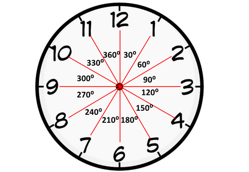

====================================================
Compass Directions
====================================================

Compass Readings
--------------------

Use ``compass.heading()`` to get an angle from True North where North is 0.

.. code-block:: python

    from microbit import *

    compass.calibrate()

    while True:
        display.scroll(compass.heading(), delay=80)
        sleep(500)

----

.. admonition:: Tasks

    #. Use the code above and turn the microbit till it reads a number close to 0.    
    #. Turn about 90 degrees clockwise to the East and get the reading.
    #. Turn another 90 degrees clockwise to the South and get the reading.
    #. Turn another 90 degrees clockwise to the West and get the reading.

----

Compass Pointer
--------------------

| The compass has readings from 0 to 360 degrees. 
| This can be divided up into 12 directions like the hours on a clock.
| The code below is to test the formula used.
| For readings from 346 to 15, the clock position should be at 12 or 0 o'clock.
| For readings from 16 to 45, the clock position should be at 11 o'clock.
| For readings from 46 to 75, the clock position should be at 10 o'clock.
| So the clock hand points towards north, while teh reading is the direction the top (where the USB connection is) of the microbit is pointing towards.

.. code-block:: python

    from microbit import *

    # compass.calibrate()

    while True:
        display.scroll(compass.heading(), delay=60)
        needle = ((-compass.heading() + 15) // 30) % 12
        display.show(Image.ALL_CLOCKS[needle])
        sleep(500)

----

.. admonition:: Tasks

    #. What are the readings for 1 o'clock?
    #. What are the readings for 3 o'clock?
    #. What are the readings for 6 o'clock?
    #. Place a small piece of paper on the ground. Point to 0 o'clock and walk 5 paces. Turn to 4 o'clock and walk 5 paces. Turn to 8 o'clock and walk 5 paces. Did you end up at your starting point?

