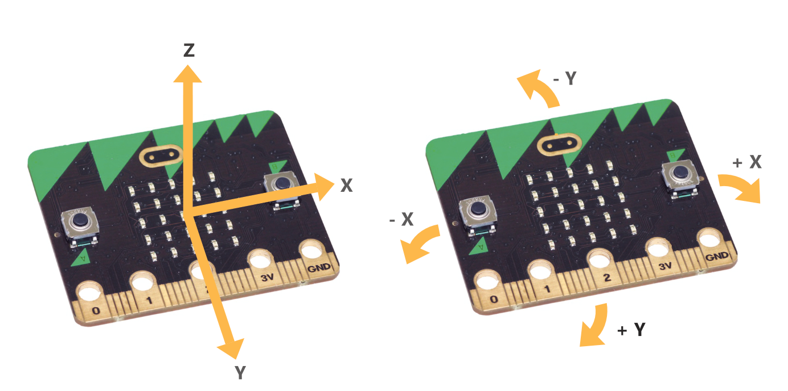

====================================================
Movement
====================================================

Mobile phone knows which up to show the images on its screen because it uses an accelerometer. Game controllers also contain accelerometers to steer and move around in games.

| The microbit accelerometer measures movement along three axes in milli-g's. 
| When the reading is 0 the microbit is "level" along that particular axis. 
| Titling it in one direction will give a positive reading; in the opposite direction a negative reading is given.

``accelerometer.get_x()``   * X - tilting left (-) and right (+).
``accelerometer.get_y()`` * Y - tilting the top backwards (-) and (+) forwards.
``accelerometer.get_z()`` * Z - tilting face up (-) and face down (+).

| The code below scrolls the reading for tilting left or right. An ``*`` is shown in between readings to make it easier to tell tehm apart.

.. code-block:: python

    from microbit import *

    while True:
        display.scroll(accelerometer.get_x(), delay=80)
        display.show('*')

----

For example, here's a very simple spirit-level that uses ``get_x`` to measure
how level the device is along the X axis:

.. code-block:: python

    from microbit import *

    while True:
        x_reading = accelerometer.get_x()
        if x_reading > 20:
            display.show("R")
        elif x_reading < -20:
            display.show("L")
        else:
            display.show("-")

If you hold the microbit flat it should display ``-``; however, tilt it left or
right and it'll show ``L`` and ``R`` respectively.

There is also a ``get_y`` method for the Y axis and a ``get_z`` method for the
Z axis.

----

.. admonition:: Tasks

    #. Modify the code above to display 'F' for tilting the top up and 'B' for tilting the bottom up (top down).
    #. Combine the code above to scroll 'RF', 'RB', 'LF' or 'LB', based on which way it is titled. Use logical ``and`` in the conditions like: ``if x_reading > 20 and y_reading > 20:``
    #. Modify the code above to display and left arrow for tilting left and a right arrow for tilting right.
    #. Modify the code above to display and up arrow for tilting the top up and a down arrow for tilting the bottom down.
    #. Modify the code above to display 'U' for moving up and 'D' for moving down.
    #. Advanced Challenge: Write code to scroll all 9 possible tilts: 'RF', 'RB','LF', 'LB', 'R', 'L', 'F', 'B', '-'.
    #. Advanced Challenge2: Write code to indicate all 9 possible tilts with 8 different arrows instead of text: ↗, ↘, ↖, ↙, →, ←, ↑, ↓, '-'.
    #. Super Advanced Challenge: Combine the two advanced challenges and use text if the A button **was** pressed and use arrows if the B button **was** pressed.

