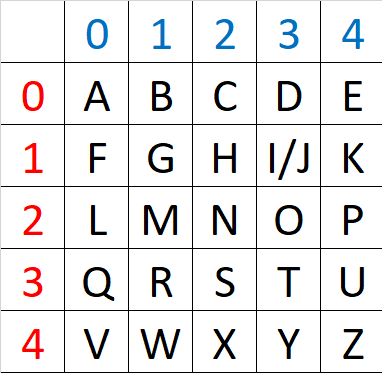
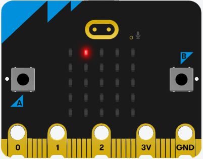

====================================================
Radio Polybius Square
====================================================

Polybius cipher
-----------------

| The **Polybius Cipher**, also known as the **Polybius Square**, is a substitution cipher that maps each letter of the alphabet to a pair of coordinates in a grid.

| **Grid Creation**: A 5x5 grid is created, and each cell is filled with a letter of the alphabet. To fit the 26 letters of the alphabet into the 25 cells created by the table, the letters I and J are usually combined into a single cell.
| **Encryption**: Each letter in the plaintext is replaced by its corresponding coordinates on the grid. For example, if B is in the cell at row 0 column 1. An image with the LED turned on at position (0, 1) represents the B.
| **Decryption**: The process is reversed to decrypt the message. The LED turned on at position (0, 1) is converted to a B.

----

Break the code
-------------------------

.. list-table:: 
    :class: table_images

    * - .. image:: images/polybius.png
            :scale: 75 %

      - .. image:: images/polybius_time_is_key.gif
            :scale: 80 %

| This script uses radio communication for sending and receiving encrypted messages. 
| The script sets up a radio group, defines a list of secret phrases, and implements a polybius square function for encryption. 
| When the A button is pressed, it selects a random secret message, applies the polybius square, sends the image strings via radio for display on the receiver's microbit, and starts a timer. 
| If button B is pressed, it stops the timer and displays the elapsed time. 
| For the receiver, the script also checks for incoming radio messages and displays them on the microbit's LED display.

.. code-block:: python
    
   from microbit import *
    import radio
    import random

    # Turn on the radio
    radio.on()
    # Choose own group in pairs 0-255
    radio.config(group=8)

    # polybius cipher letters
    ALPHABET = "ABCDEFGHIJKLMNOPQRSTUVWXYZ"

    # secrets to be chosen from
    SECRETS = [
        "MEET AT DAWN",
        "THE BIRD HAS FLOWN",
        "TRUST NO ONE",
        "SEEK THE TRUTH",
        "SECURE THE ASSET",
        "AVOID DETECTION",
        "KEEP MOVING",
        "STAY HIDDEN",
        "WATCH YOUR BACK",
        "TIME IS KEY",
    ]

    # Define the Polybius square
    # I and J now share the same grid cell
    polybius_square = {
        "A": (0, 0),
        "B": (1, 0),
        "C": (2, 0),
        "D": (3, 0),
        "E": (4, 0),
        "F": (0, 1),
        "G": (1, 1),
        "H": (2, 1),
        "I": (3, 1),  
        "J": (3, 1),  
        "K": (4, 1),
        "L": (0, 2),
        "M": (1, 2),
        "N": (2, 2),
        "O": (3, 2),
        "P": (4, 2),
        "Q": (0, 3),
        "R": (1, 3),
        "S": (2, 3),
        "T": (3, 3),
        "U": (4, 3),
        "V": (0, 4),
        "W": (1, 4),
        "X": (2, 4),
        "Y": (3, 4),
        "Z": (4, 4),
    }

    # Function to extract numbers from the image string
    def extract_image_string(image):
        # Convert the image to a string
        full_image_string = str(image)
        # Replace the colon and newline characters with an empty string
        image_string = full_image_string.replace("'", "").replace("\n", "").replace(" ", "").replace("(", "").replace(")", "").replace("Image", "")
        return image_string

    def polybius_cipher(message):
        cipher_imgstring_list = []
        for char in message:
            if char in ALPHABET:
                # Get the coordinates for the letter
                x, y = polybius_square[char.upper()]
                # Create an empty image
                img = Image("00000:" * 5)
                # Set the pixel at the coordinates to 9
                img.set_pixel(x, y, 9)
                cipher_imgstring_list.append(extract_image_string(img))
            else:
                img = Image("00000:" * 5)
                cipher_imgstring_list.append(extract_image_string(img))
        return cipher_imgstring_list

    def receive_image():
        # Receive a message from the radio
        incoming = radio.receive()
        if incoming:
            try:
                display.show(Image(incoming))
            except:
                display.show(incoming)

    # Initialize timer
    timer = 0

    while True:
        # Check button presses to send a secret message
        if button_a.was_pressed():
            # Select a random secret message and add a space so the final dot is cleared automatically
            secret = random.choice(SECRETS) + " "
            # Display the secret message on the sender's microbit
            display.scroll(secret, delay=100, wait=False)
            cipher_texts = polybius_cipher(secret)
            for cipher_text in cipher_texts:
                radio.send(cipher_text)
                sleep(1000)
            # Start the timer
            timer = running_time()
        elif button_b.was_pressed() and timer:
            # time must be not 0; so A button must be pressed first
            # Stop the timer and display the elapsed time in seconds
            elapsed_time = int((running_time() - timer) / 1000)
            display.scroll(str(elapsed_time))
            timer = 0
        # Check for incoming messages
        receive_image()

----

.. admonition:: Exercises

    #. Challenge your partner to crack the code. Use a polybius grid on paper to help decryption. Press A, read the message sent, and then press B when your partner has worked out the message correctly. Write down the time and reverse rolls to see who has the best time.
