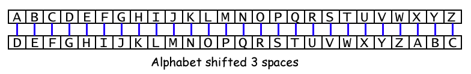

====================================================
Radio secrets
====================================================

Caesar cipher
-----------------

| The **Caesar cipher**, also known as **Caesar's cipher**, the **shift cipher**, **Caesar's code**, or **Caesar shift**, is one of the simplest and most widely known encryption techniques. 
| It is a type of substitution cipher in which each letter in the plaintext is replaced by a letter some fixed number of positions down the alphabet.

| For example, with a right shift of 3, A would be replaced by D, B would become E, and so on.
| Deciphering is done in reverse, with a left shift of 3.

| Here's an example of how it works:
| Plaintext:  THE QUICK BROWN FOX JUMPS OVER THE LAZY DOG
| Ciphertext: WKH TXLFN EURZQ IRA MXPSV RYHU WKH ODCB GRJ

----

Break the code
-------------------------

| This script uses radio communication for sending and receiving encrypted messages. 
| The script sets up a radio group, defines a list of secret phrases, and implements a Caesar shift cipher function for encryption. 
| When the A button is pressed, it selects a random secret message, applies the Caesar cipher with a random shift, sends the encrypted message via radio, and starts a timer. 
| If button B is pressed, it stops the timer and displays the elapsed time. 
| For the receiver, the script also checks for incoming radio messages and displays them on the micro:bit's LED display.

.. code-block:: python
    
    from microbit import *
    import radio
    import random

    # Set up radio with group from 1 to 25 to reuse it for the shift
    radio.config(group=8)
    radio.on()

    # Caesar cipher letters
    ALPHABET = "ABCDEFGHIJKLMNOPQRSTUVWXYZ"
    # secrets to be chosen from
    SECRETS = [
        "MEET AT DAWN",
        "THE BIRD HAS FLOWN",
        "TRUST NO ONE",
        "SEEK THE TRUTH",
        "SECURE THE ASSET",
        "AVOID DETECTION",
        "KEEP MOVING",
        "STAY HIDDEN",
        "WATCH YOUR BACK",
        "TIME IS KEY",
    ]
    # Caesar cipher shift to be chosen from
    SHIFTS = [-1, 1]

    def caesar_cipher(message, shift):
        """
        Apply a Caesar cipher to a message.
        """
        cipher_text = ""
        for char in message:
            if char in ALPHABET:
                # Shift character
                index = (ALPHABET.index(char) + shift) % len(ALPHABET)
                cipher_text += ALPHABET[index]
            else:
                cipher_text += char
        return cipher_text

    # Initialize timer
    timer = 0

    while True:
        # Check button presses to send a secret message
        if button_a.was_pressed():
            # Select a random shift
            shift = random.choice(SHIFTS)
            # Select a random secret message
            secret = random.choice(SECRETS)
            cipher_text = caesar_cipher(secret, shift)
            radio.send(cipher_text)
            # Display the secret message on the sender's microbit
            display.scroll(secret, delay=100)
            # Start the timer
            timer = running_time()
        elif button_b.was_pressed() and timer:
            # time must be not 0; so A button must be pressed first
            # Stop the timer and display the elapsed time in seconds
            elapsed_time = int((running_time() - timer) / 1000)
            display.scroll(str(elapsed_time))
            timer = 0
        # Check for incoming messages
        incoming = radio.receive()
        if incoming:
            # Display the shifted secret message
            display.scroll(incoming, delay=100)

----

.. admonition:: Exercises

    #. Challenge your partner to crack the code. Press A, read the message sent, and then press B when your partner has worked out the message correctly. Write down the time and reverse rolls to see who has the best time.

----

Code breaker
-------------------------

| Set up the group with a value 1 to 25 by changing the group value from 8 in: ``radio.config(group=8)``.
| Turn on the radio using: ``radio.on()``
| Enter a secret message to send.
| Scroll any received messages.
| ``if incoming_message is not None:`` relies on ``radio.receive()`` returning **None** when there is no message received. 

.. code-block:: python
    
    from microbit import *
    import radio

    # Set up radio with group from 1 to 25 to reuse it for the shift
    shift = 25
    radio.config(group=shift)
    radio.on()

    # Caesar cipher parameters
    ALPHABET = 'ABCDEFGHIJKLMNOPQRSTUVWXYZ'
    SECRET = 'WE_ARE_GROUP' + str(shift)

    def caesar_cipher(message, shift):
        """
        Apply a Caesar cipher to a message.
        """
        cipher_text = ''
        for char in message:
            if char in ALPHABET:
                # Shift character
                index = (ALPHABET.index(char) + shift) % len(ALPHABET)
                cipher_text += ALPHABET[index]
            else:
                cipher_text += char
        return cipher_text

    while True:
        # Check button presses to send a secret message
        if button_a.was_pressed():
            cipher_text = caesar_cipher(SECRET, SHIFT)
            radio.send(cipher_text)
        # Check for incoming messages
        incoming = radio.receive()
        if incoming:
            # Decode and display the message
            message = caesar_cipher(incoming, -SHIFT)
            display.scroll(message)

----

.. admonition:: Exercises

    #. Modify the group and secret.
    #. Try setting up random groups by setting the group to a random integer from 1 to 9. Also use a secret message based on that group number.

----

Caesar cipher 2
-------------------------

| What does this code do?
| What happens when the black reset button is pressed?

.. code-block:: python
    
    from microbit import *
    import radio
    import random

    # Set up radio with group from 1 to 6 to reuse it for the shift
    radio.on()

    # Caesar cipher parameters

    ALPHABET = 'ABCDEFGHIJKLMNOPQRSTUVWXYZ'
    group_x = random.randint(1, 3)
    radio.config(channel=7, group=group_x)
    SHIFT = group_x
    SECRET = 'UR' + str(group_x)

    def caesar_cipher(message, shift):
        """
        Apply a Caesar cipher to a message.
        """
        cipher_text = ''
        for char in message:
            if char in ALPHABET:
                # Shift character
                index = (ALPHABET.index(char) + shift) % len(ALPHABET)
                cipher_text += ALPHABET[index]
            else:
                cipher_text += char
        return cipher_text

    while True:
        # Check button presses to send a secret message
        if button_a.was_pressed():
            cipher_text = caesar_cipher(SECRET, SHIFT)
            radio.send(cipher_text)
        elif button_b.was_pressed():
            display.scroll(SHIFT)
        # Check for incoming messages
        incoming = radio.receive()
        if incoming:
            # Decode and display the message
            message = caesar_cipher(incoming, -group_x)
            display.scroll(message)

            

.. admonition:: Exercises

    #. Class activity: Write code to randomly change the group number, choosing from 11 to 19, after a message is received or on pressing the B-button. Use the A-button to send a message. Keep count of the the number of messages received and pulse the diamond images after every 5 messages received.

