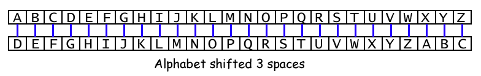

====================================================
Radio shift cipher
====================================================

Caesar cipher
-----------------

| The **Caesar cipher**, also known as **Caesar's cipher**, the **shift cipher**, **Caesar's code**, or **Caesar shift**, is one of the simplest and most widely known encryption techniques. 
| It is a type of substitution cipher in which each letter in the plaintext is replaced by a letter some fixed number of positions down the alphabet.

| For example, with a right shift of 3, A would be replaced by D, B would become E, and so on.
| Deciphering is done in reverse, with a left shift of 3.

| Here's an example of how it works:
| Plaintext:  THE QUICK BROWN FOX JUMPS OVER THE LAZY DOG
| Ciphertext: WKH TXLFN EURZQ IRA MXPSV RYHU WKH ODCB GRJ

----

Break the code
-------------------------

| This script uses radio communication for sending and receiving encrypted messages. 
| The script sets up a radio group, defines a list of secret phrases, and implements a Caesar shift cipher function for encryption. 
| When the A button is pressed, it selects a random secret message, applies the Caesar cipher with a small random shift, sends the encrypted message via radio, and starts a timer. 
| If button B is pressed, it stops the timer and displays the elapsed time. 
| For the receiver, the script also checks for incoming radio messages and displays them on the microbit's LED display.

.. code-block:: python
    
    from microbit import *
    import radio
    import random

    # Turn on the radio
    radio.on()
    # Choose own group in pairs 0-255
    radio.config(group=8)

    # Caesar cipher letters
    ALPHABET = "ABCDEFGHIJKLMNOPQRSTUVWXYZ"
    # secrets to be chosen from
    SECRETS = [
        "MEET AT DAWN",
        "THE BIRD HAS FLOWN",
        "TRUST NO ONE",
        "SEEK THE TRUTH",
        "SECURE THE ASSET",
        "AVOID DETECTION",
        "KEEP MOVING",
        "STAY HIDDEN",
        "WATCH YOUR BACK",
        "TIME IS KEY",
    ]
    # Caesar cipher shift to be chosen from
    SHIFTS = [-1, 1]

    def caesar_cipher(message, shift):
        """
        Apply a Caesar cipher to a message.
        """
        cipher_text = ""
        for char in message:
            if char in ALPHABET:
                # Shift character
                index = (ALPHABET.index(char) + shift) % len(ALPHABET)
                cipher_text += ALPHABET[index]
            else:
                cipher_text += char
        return cipher_text

    # Initialize timer
    timer = 0

    while True:
        # Check button presses to send a secret message
        if button_a.was_pressed():
            # Select a random shift
            shift = random.choice(SHIFTS)
            # Select a random secret message
            secret = random.choice(SECRETS)
            cipher_text = caesar_cipher(secret, shift)
            radio.send(cipher_text)
            # Display the secret message on the sender's microbit
            display.scroll(secret, delay=100)
            # Start the timer
            timer = running_time()
        elif button_b.was_pressed() and timer:
            # time must be not 0; so A button must be pressed first
            # Stop the timer and display the elapsed time in seconds
            elapsed_time = int((running_time() - timer) / 1000)
            display.scroll(str(elapsed_time))
            timer = 0
        # Check for incoming messages
        incoming = radio.receive()
        if incoming:
            # Display the shifted secret message
            display.scroll(incoming, delay=100)

----

.. admonition:: Exercises

    #. Challenge your partner to crack the code. Press A, read the message sent, and then press B when your partner has worked out the message correctly. Write down the time and reverse rolls to see who has the best time.

----

Code breaker: brute force
-------------------------

| The term “brute force” in the context of decryption refers to the method of trying all possible keys until the correct one is found. 
| In the case of a Caesar cipher, which is used in the code below, the key is the shift value used to encrypt the original message.
| Since there are only 25 possible shifts (for the 26 letters of the alphabet), it's feasible to try all of them to decrypt the message. 
| This is exactly what the code does when it receives an encrypted message: it applies each possible shift and displays the result, effectively “brute forcing” the decryption.

| Sender:
| If button A is pressed, a random secret message is selected, encrypted using the Caesar cipher with a random shift, and then sent via the radio. 
| The original message is also scrolled on the microbit's LED display. 
| If button B is pressed, the elapsed time since button A was pressed is calculated and displayed.
| Receiver:
| The program continuously checks for incoming radio messages. 
| If a message is received, it attempts to decrypt it by applying all possible shifts in the Caesar cipher and scrolling each attempt on the display. 
| If button B is pressed during this process, the decryption attempts stop and the current decrypted message is displayed.

.. code-block:: python
        
    from microbit import *
    import radio
    import random

    # Turn on the radio
    radio.on()
    # Choose own group in pairs 0-255
    radio.config(group=8)

    # Caesar cipher letters
    ALPHABET = "ABCDEFGHIJKLMNOPQRSTUVWXYZ"
    # secrets to be chosen from
    SECRETS = [
        "MEET AT DAWN",
        "THE BIRD HAS FLOWN",
        "TRUST NO ONE",
        "SEEK THE TRUTH",
        "SECURE THE ASSET",
        "AVOID DETECTION",
        "KEEP MOVING",
        "STAY HIDDEN",
        "WATCH YOUR BACK",
        "TIME IS KEY",
    ]
    # Caesar cipher shift to be chosen from
    SHIFTS = [-1, 1, -2, 2, -3, 3, -4, 4, -5, 5, -6, 6, -7, 7, -8, 8, -9, 9, -10, 10, -11, 11, -12, 12, -13, 13]

    def caesar_cipher(message, shift):
        """
        Apply a Caesar cipher to a message.
        """
        cipher_text = ""
        for char in message:
            if char in ALPHABET:
                # Shift character
                index = (ALPHABET.index(char) + shift) % len(ALPHABET)
                cipher_text += ALPHABET[index]
            else:
                cipher_text += char
        return cipher_text

    # Initialize timer
    timer = 0

    while True:
        # Check button presses to send a secret message
        if button_a.was_pressed():
            # Select a random shift
            shift = random.choice(SHIFTS)
            # Select a random secret message
            secret = random.choice(SECRETS)
            cipher_text = caesar_cipher(secret, shift)
            radio.send(cipher_text)
            # Display the secret message on the sender's microbit
            display.scroll(secret, delay=100)
            # Start the timer
            timer = running_time()
        elif button_b.was_pressed() and timer:
            # time must be not 0; so A button must be pressed first
            # Stop the timer and display the elapsed time in seconds
            elapsed_time = int((running_time() - timer) / 1000)
            display.scroll(str(elapsed_time))
            timer = 0
        # Check for incoming messages
        # Brute force decode and display the message
        incoming = radio.receive()
        if incoming:
            message = incoming
            display.scroll(message, delay=100)
            # Brute force decode and display the message; stop loop with B button
            for shift_i in SHIFTS:
                message = caesar_cipher(incoming, shift_i)
                display.scroll(message, delay=100)
                if button_b.was_pressed():
                    break
                sleep(100)
            display.scroll(message, delay=100)

----

.. admonition:: Exercises

    #. Challenge your partner to crack the code using the brute force decrypting. Press A, read the message sent, and then press B when your partner has worked out the message correctly. Write down the time and reverse rolls to see who has the best time.

