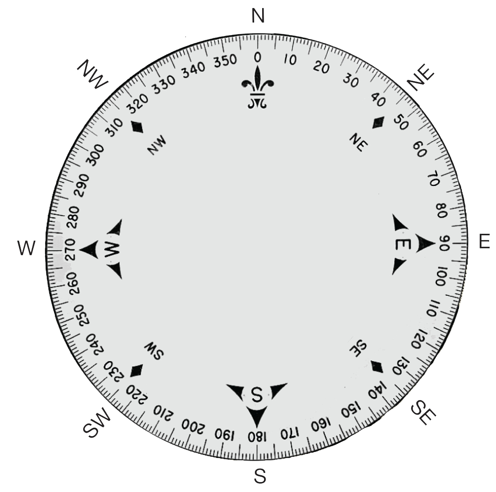

====================================================
Compass syntax
====================================================

.. py:module:: compass

This module lets you access the built-in electronic compass. Before using,
the compass should be calibrated, otherwise the readings may be wrong.

.. tip::

    | Calibrating the compass will cause your program to pause until calibration is complete. 
    | Calibration consists of tilting the microbit to fill the LED display.

Main Functions
----------------

.. py:function:: calibrate()

    Starts the calibration process. A message 'TILT TO FILL SCREEN' will be scrolled to the user after which the user will need to tilt the microbit to fill the LED display.

    
.. py:function:: heading()

    Gives the compass heading, calculated from the above readings, as an
    integer in the range from 0 to 360, representing the angle in degrees,
    clockwise, with north as 0.

----

Other Functions
----------------

.. py:function:: is_calibrated()

    Returns ``True`` if the compass has been successfully calibrated, and
    returns ``False`` otherwise.

.. py:function:: clear_calibration()

    Undoes the calibration, making the compass uncalibrated again.

.. py:function:: get_x()

    Gives the reading of the magnetic field strength on the ``x`` axis in nano 
    tesla, as a positive or negative integer, depending on the direction of the
    field.

.. py:function:: get_y()

    Gives the reading of the magnetic field strength on the ``y`` axis in nano 
    tesla, as a positive or negative integer, depending on the direction of the
    field.

.. py:function:: get_z()

    Gives the reading of the magnetic field strength on the ``z`` axis in nano 
    tesla, as a positive or negative integer, depending on the direction of the
    field.

.. py:function:: get_field_strength()

    Returns an integer indication of the magnitude of the magnetic field around
    the device in nano tesla.

