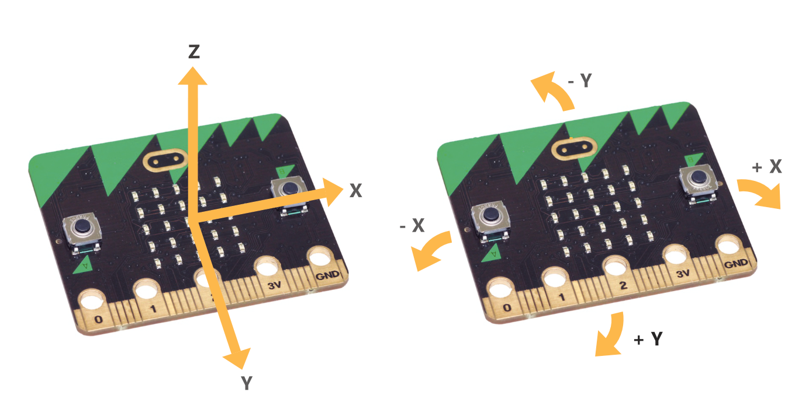

====================================================
Movement
====================================================

Accelerometer
-----------------

Mobile phone knows which up to show the images on its screen because it uses an accelerometer. Game controllers also contain accelerometers to steer and move around in games.

| The microbit accelerometer measures movement along three axes in milli-g's. 
| When the reading is 0 the microbit is "level" along that particular axis. 
| Titling it in one direction will give a positive reading; in the opposite direction a negative reading is given.

``accelerometer.get_x()`` * X - tilting the left edge down (-) and the right edge down (+).
``accelerometer.get_y()`` * Y - tilting the top edge down (-) and the bottom edge down (+).
``accelerometer.get_z()`` * Z - moving down (-) and moving up (+).

| The code below scrolls the reading for tilting left or right. An ``*`` is shown in between readings to make it easier to tell them apart.

.. code-block:: python

    from microbit import *

    while True:
        display.scroll(accelerometer.get_x(), delay=80)
        display.show('*')

----

Spirit level
-------------------

| For example, here's a very simple spirit-level that uses ``get_x`` to measure
how level the device is along the X axis.
| A reading of 20 is small enough to make this very sensitive to a slight tilt. 

.. code-block:: python

    from microbit import *

    while True:
        x_reading = accelerometer.get_x()
        if x_reading > 20:
            display.show("R")
        elif x_reading < -20:
            display.show("L")
        else:
            display.show("-")

| Hold the microbit flat it should display ``-``.
| Tilt it left and it'll show ``L``.
| Tilt it right and it'll show ``R``.

There is also a ``get_y`` method for the Y axis and a ``get_z`` method for the
Z axis.

----

.. admonition:: Tasks

    #. Modify the code above to get an x_val, which is "R", "-" or "L", then scroll the x_val.
    #. Modify the code above to display 'T' for tilting the top edge down and 'B' for tilting the bottom edge down.
    #. Modify the code above to get an y_val, which is "T", "-" or "B", then scroll the y_val.
    #. Combine the code using x-val and y_val to scroll all 9 possible tilts: 'RT', 'R-', 'RB', 'LT', 'L-', 'LB', '-T', '--', '-B'. Do this by first getting the x_val and y_val as before, then scrolling these together by concatenating them. Add a 250ms sleep to pause briefly before the next reading.

    .. dropdown::
        :icon: codescan
        :color: primary
        :class-container: sd-dropdown-container

        .. tab-set::

            .. tab-item:: Q1

                Modify the code above to get an x_val which is "R", "-" or "L", then scroll the x_val.

                .. code-block:: python

                    from microbit import *

                    while True:
                        x_reading = accelerometer.get_x()
                        if x_reading > 20:
                            x_val = "R"
                        elif x_reading < -20:
                            x_val = "L"
                        else:
                            x_val = "-"
                        display.scroll(x_val)

            .. tab-item:: Q2

                Modify the code above to display 'T' for tilting the top edge down and 'B' for tilting the bottom edge down.

                .. code-block:: python

                    from microbit import *

                    while True:
                        y_reading = accelerometer.get_y()
                        if y_reading > 20:
                            display.show("B")
                        elif y_reading < -20:
                            display.show("T")
                        else:
                            display.show("-")

            .. tab-item:: Q3

                Modify the code above to get an y_val, which is "T", "-" or "B", then scroll the y_val.

                .. code-block:: python

                    from microbit import *

                    while True:
                        y_reading = accelerometer.get_y()
                        if y_reading > 20:
                            y_val = "B"
                        elif y_reading < -20:
                            y_val = "T"
                        else:
                            y_val = "-"
                        display.scroll(y_val)

            .. tab-item:: Q4

                Combine the code using x-val and y_val to scroll all 9 possible tilts: 'RT', 'R-', 'RB', 'LT', 'L-', 'LB', '-T', '--', '-B'. Do this by first getting the x_val and y_val as before, then scrolling these together by concatenating them. Add a 250ms sleep to pause briefly before the next reading.

                .. code-block:: python

                    from microbit import *

                    while True:
                        x_reading = accelerometer.get_x()
                        if x_reading > 20:
                            x_val = "R"
                        elif x_reading < -20:
                            x_val = "L"
                        else:
                            x_val = "-"   
                        y_reading = accelerometer.get_y()
                        if y_reading > 20:
                            y_val = "B"
                        elif y_reading < -20:
                            y_val = "T"
                        else:
                            y_val = "-"
                        display.scroll(x_val + y_val, delay=80)
                        sleep(250)

----

.. admonition:: Tasks

    #. Modify the code above to display and left arrow for tilting left and a right arrow for tilting right.
    #. Modify the code above to display an up arrow for tilting the top down and a down arrow for tilting the bottom down.
    #. Write code to indicate all 9 possible tilts with 8 different arrows instead of text: ↗, ↘, ↖, ↙, →, ←, ↑, ↓, '-'. Use nested if statements by nesting the y code within each branch of the x code. Add a 250ms sleep to pause briefly before the next reading.

    .. dropdown::
        :icon: codescan
        :color: primary
        :class-container: sd-dropdown-container

        .. tab-set::

            .. tab-item:: Q1

                Modify the code above to display a left arrow for tilting left and a right arrow for tilting right.

                .. code-block:: python

                    from microbit import *

                    while True:
                        x_reading = accelerometer.get_x()
                        if x_reading > 20:
                            display.show(Image.ARROW_E)
                        elif x_reading < -20:
                            display.show(Image.ARROW_W)
                        else:
                            display.show("-")

            .. tab-item:: Q2

                Modify the code above to display an up arrow for tilting the top down and a down arrow for tilting the bottom down.

                .. code-block:: python

                    from microbit import *

                    while True:
                        y_reading = accelerometer.get_y()
                        if y_reading > 20:
                            display.show(Image.ARROW_S)
                        elif y_reading < -20:
                            display.show(Image.ARROW_N)
                        else:
                            display.show("-")

            .. tab-item:: Q3

                Write code to indicate all 9 possible tilts with 8 different arrows instead of text: ↗, ↘, ↖, ↙, →, ←, ↑, ↓, '-'. Use nested if statements by nesting the y code within each branch of the x code. Add a 250ms sleep to pause briefly before the next reading.

                .. code-block:: python

                    from microbit import *

                    while True:
                        x_reading = accelerometer.get_x()
                        y_reading = accelerometer.get_y()
                        if x_reading > 20:
                            if y_reading > 20:
                                display.show(Image.ARROW_SE)
                            elif y_reading < -20:
                                display.show(Image.ARROW_NE)
                            else:
                                display.show(Image.ARROW_E)
                        elif x_reading < -20:
                            if y_reading > 20:
                                display.show(Image.ARROW_SW)
                            elif y_reading < -20:
                                display.show(Image.ARROW_NW)
                            else:
                                display.show(Image.ARROW_W)
                        else:
                            if y_reading > 20:
                                display.show(Image.ARROW_S)
                            elif y_reading < -20:
                                display.show(Image.ARROW_N)
                            else:
                                display.show("-")
                        sleep(200)

----

.. admonition:: Tasks

    #. Combine the two tasks which displayed output for the 9 differnt tilts and use text if the A-button **is** pressed and use arrows if the B-button **is** pressed. Clear the screen if no button is pressed.

    .. dropdown::
        :icon: codescan
        :color: primary
        :class-container: sd-dropdown-container

        .. tab-set::

            .. tab-item:: Q1

                Combine the two tasks which displayed output for the 9 differnt tilts and use text if the A-button **is** pressed and use arrows if the B-button **is** pressed. Clear the screen if no button is pressed.

                .. code-block:: python

                    from microbit import *

                    while True:
                        x_reading = accelerometer.get_x()
                        y_reading = accelerometer.get_y()

                        if button_a.is_pressed():
                            if x_reading > 20:
                                x_val = "R"
                            elif x_reading < -20:
                                x_val = "L"
                            else:
                                x_val = "-"   
                            if y_reading > 20:
                                y_val = "B"
                            elif y_reading < -20:
                                y_val = "T"
                            else:
                                y_val = "-"
                            display.scroll(x_val + y_val, delay=80)  

                        elif button_b.is_pressed():                    
                            if x_reading > 20:
                                if y_reading > 20:
                                    display.show(Image.ARROW_SE)
                                elif y_reading < -20:
                                    display.show(Image.ARROW_NE)
                                else:
                                    display.show(Image.ARROW_E)
                            elif x_reading < -20:
                                if y_reading > 20:
                                    display.show(Image.ARROW_SW)
                                elif y_reading < -20:
                                    display.show(Image.ARROW_NW)
                                else:
                                    display.show(Image.ARROW_W)
                            else:
                                if y_reading > 20:
                                    display.show(Image.ARROW_S)
                                elif y_reading < -20:
                                    display.show(Image.ARROW_N)
                                else:
                                    display.show("-")

                        else:
                            display.clear() 

                        sleep(250)
    
